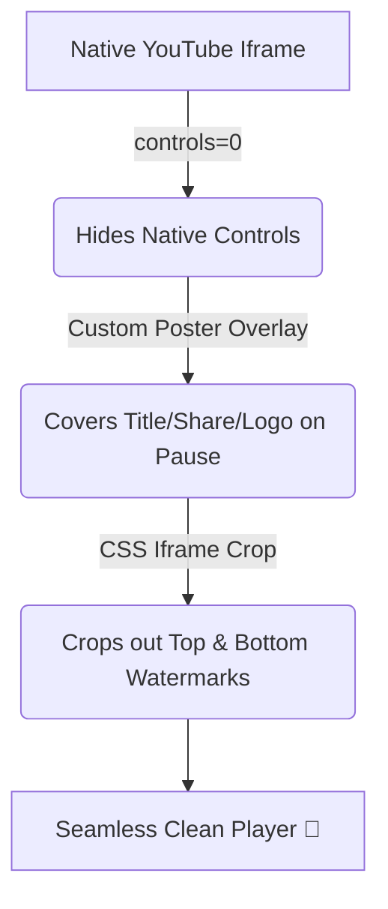

<div align="center">

# 🎬 Standalone YouTube Player Without Controls (Vanilla JS)

[](https://opensource.org/licenses/MIT)
[](https://developer.mozilla.org/en-US/docs/Web/JavaScript)
[]()

A tiny, **dependency-free** clean YouTube player — embed YouTube videos with **no YouTube logo, title bar, share button, native controls, or end-screen recommendations**. Renders its own sleek, minimal control bar.


</div>

---

## ✨ Why this?

This is the same technique learning platforms like **Learnyst / Tutor LMS** use to make YouTube-hosted lessons look like a native, branding-free player — while still using YouTube's free, unlimited CDN.

> **Note:** Looking for the React version? See the [React Version](https://github.com/somanisuryateja/Standalone_Youtube_player_without_controls_React).

## 🚀 Live Demo

Open `index.html` in a browser (or serve the folder), paste any YouTube URL, and hit **Load video**.

```bash
# Any static server works, e.g.:
npx serve .
# Then open http://localhost:3000
```

## 🛠️ Usage

```html
<!-- 1. Include the styles -->
<link rel="stylesheet" href="clean-youtube-player.css" />

<!-- 2. Create a container -->
<div id="player"></div>

<!-- 3. Include the script -->
<script src="clean-youtube-player.js"></script>

<!-- 4. Initialize the player -->
<script>
  const player = new CleanYouTubePlayer(document.getElementById("player"), {
    videoId: "aqz-KE-bpKQ",   // or:  url: "https://youtu.be/aqz-KE-bpKQ"
    accent: "#6d28d9",         // optional brand color
  });
</script>
```

## ⚙️ Configuration API

| Option | Type | Default | Description |
| :--- | :--- | :--- | :--- |
| `videoId` | `string` | **Required*** | The YouTube video ID. |
| `url` | `string` | **Required*** | Full YouTube URL (used if `videoId` omitted). |
| `accent` | `string` | `"#6d28d9"` | CSS hex color for control buttons/progress. |

**Methods:**
- `player.toggle()`
- `player.toggleMute()`
- `player.destroy()`

**Static Methods:**
- `CleanYouTubePlayer.extractId(urlOrId)`

## 📁 Files included

- `clean-youtube-player.js` — The core player logic (~6 KB).
- `clean-youtube-player.css` — Responsive, minimal styles.
- `index.html` — Interactive demo page.

## 🧠 How it Stays "Clean"

YouTube's IFrame API can't fully remove branding by itself, so this uses three powerful tricks:



A transparent overlay also blocks all clicks into the iframe, preventing users from clicking out to YouTube or seeing right-click menus.

## ⚠️ Disclaimer: This is not DRM

The video is still served by YouTube, meaning the source ID is discoverable via devtools. Ideal for **normal / free lessons**. For **paid or piracy-sensitive content**, please use protected hosts (Cloudflare Stream, Vimeo Pro, AWS IVS) with signed URLs and optional DRM.

## 📄 License

This project is licensed under the MIT License.
